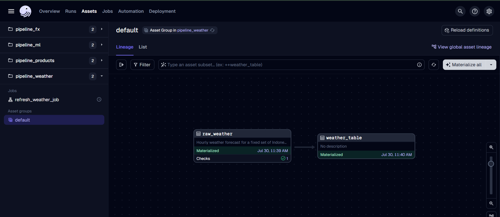
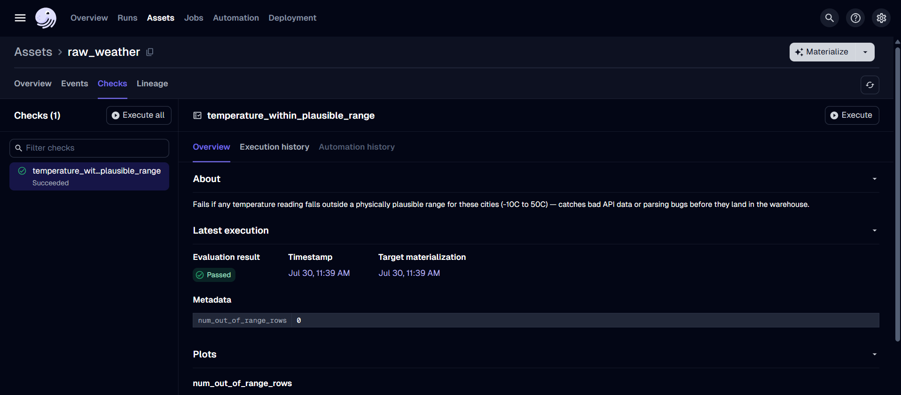
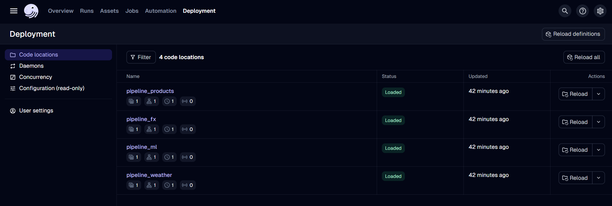
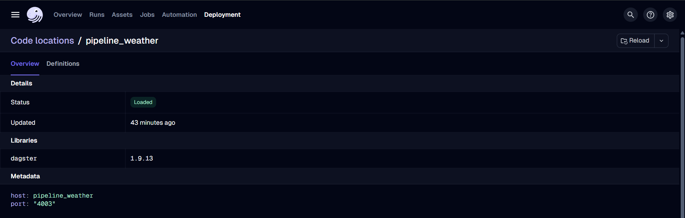
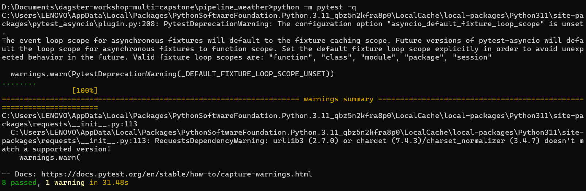

Hourly weather forecast pipeline for three Indonesian cities (Jakarta, Bandung, Surabaya), pulled from the free Open-Meteo API. I picked weather data because it's a public API with no key required, updates frequently (good fit for a scheduled Dagster job), and has a clear physical sanity check I could build an `@asset_check` around.

Built on top of [dagster-workshop-multi](https://github.com/<original-org>/dagster-workshop-multi), a multi-container Dagster workshop — see that repo's README for the base architecture (`pipeline_products`, `pipeline_fx`, `pipeline_ml`).

## What I built

- **Track:** A — new source pipeline
- **Data source:** [Open-Meteo Forecast API](https://open-meteo.com/en/docs) (no API key required)
- **Key assets:**
  - `raw_weather` — fetches hourly forecast (temperature, precipitation, wind speed) for Jakarta, Bandung, and Surabaya, flattens the response into a tidy DataFrame
  - `weather_table` — loads `raw_weather` into the shared warehouse as a `weather` table
- **Quality gate:** `temperature_within_plausible_range` — fails if any temperature reading falls outside -10C to 50C. I chose that range because it's physically implausible for these three cities at any time of year, so a value outside it almost certainly means bad API data or a parsing bug, not real weather.

## Architecture

```
                     dagster_webserver (:3000)  <-- workspace.yaml -->  dagster_daemon
                              |                                              |
                              +---------------------+-----------------------+
                                                     |
                             dagster_postgresql  (Dagster's own run/schedule/event storage)

  pipeline_products (:4000)     pipeline_fx (:4001)     pipeline_ml (:4002)     pipeline_weather (:4003)
  fakestoreapi.com ->            api.frankfurter.app ->  trains a classifier     api.open-meteo.com ->
  raw_products/raw_orders        raw_exchange_rates      on products+orders,     raw_weather (3 cities,
        |                              |                 writes predictions      hourly)
        v                              v                 back                          |
  products, orders  --------->  warehouse_postgresql  <------------------------------- +
  tables                        (also: exchange_rates,
                                  order_value_predictions, weather)
```

`pipeline_weather` follows the same pattern as `pipeline_products`/`pipeline_fx`: its own container, its own gRPC code server on port 4003, pulling from an external API into the shared `warehouse_postgresql` database. Like the other ingestion pipelines, it writes with a simple truncate-and-load (`if_exists="replace"`).

## Running it

```bash
docker compose up --build
```

Open http://localhost:3000, find `pipeline_weather` under Deployment > Code Locations, and materialize its assets (`raw_weather`, `weather_table`).

## Screenshots needed

To evidence this pipeline, the following screenshots were captured from the Dagster UI at `http://localhost:3000` (after `docker compose up --build` and materializing all assets) and from a local terminal run of `pytest`:

| # | Screenshot | Why it's needed |
|---|---|---|
| 1 | Assets tab — asset lineage graph (`raw_weather` → `weather_table`), both showing green / "Materialized" | Proves the whole pipeline ran successfully end to end. |
| 2 | Asset detail page for `raw_weather`, "Checks" tab showing `temperature_within_plausible_range` as Passed | Proves the asset check is registered and passing, not just present in the code. |
| 3 | Deployment > Code Locations, showing `pipeline_weather` with status Loaded | Proves `pipeline_weather` runs as its own independent code location/container. |
| 4 | Terminal output of `pytest -q` showing "8 passed" | Proves the code is correct independent of the UI/Docker environment. |

## Demo

**Asset lineage** — `raw_weather` → `weather_table`, both materialized, with the `temperature_within_plausible_range` check passing (✓ 1):



**Asset check detail** — the quality gate passing with zero out-of-range readings:



**Code locations** — `pipeline_weather` loaded alongside the other three pipelines, each as its own independent container:



**Code location detail** — `pipeline_weather` running as its own gRPC server on port 4003:



**pytest run** — 8 tests passing locally, independent of Docker and the Dagster UI:



## What I'd do differently in production

The truncate-and-load pattern means every run wipes and replaces the whole `weather` table — fine for a workshop, but in production I'd want an append-only history table so I could actually analyze trends over time instead of only ever seeing the latest snapshot. I'd also add retry logic around the Open-Meteo request (right now a single timeout just fails the run), move the warehouse credentials into a real secrets manager instead of plain environment variables, and add alerting on asset check failures so a bad reading gets flagged before anyone notices the dashboard looks wrong.
